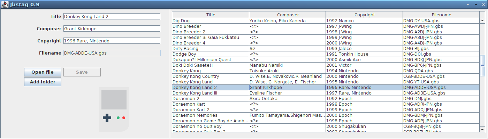

# jbstag : Java GBS Tagger


[jbstag](https://github.com/ullenius/jbstag-goodies) is a tagger for GBS-files made in Java (Swing).

Reads and edits tags from Game Boy music files (GBS).


## Features
* :heavy_check_mark: 100% Java (Java 8) :coffee:
* :heavy_check_mark: Supports UTF-8 encoding in the tags!
* :heavy_check_mark: Multi-platform.
* :heavy_check_mark: Edit multiple files at once.

## Building
This is a Maven-project.

Run:
```sh
mvn clean install assembly:single
```
to build the JAR-file.

Or run the build-script provided:
```sh
./build.sh
```

## Install
I've included a executable jar-file to simplify for end-users who can't compile stuff on their platform.
* Download [jbstag-goodies0.9.1.zip](https://github.com/ullenius/jbstag-goodies/releases/download/v0.9.1-beta/jbstag-goodies0.9.1.zip)


## Issues
There might be some issues on your platform with the UTF-8 fonts not rendering properly. This is a Swing issue.


## Development
This is re-written implementation of jbstag. GUI is now hand-coded and the I/O is handled by my improved [gbs-lib](https://github.com/ullenius/gbstab-lib) as an external JAR-library.

It was made as a way to learn Swing, Jgoodies Forms and Binding frameworks.The latter is a port of the data binding framework from Smalltalk Visual Works.


## Changelog
* 0.9 - improved version. Adds a list view for editing multiple files. May 2021

## Licence
GPL 3 only. See COPYING

### Credits
The [Gameboy icon](https://www.iconfinder.com/icons/381627/gameboy_icon) used in the program is made by [Tahsin Tahil](https://tahsintahil.tumblr.com/) and licensed under [CC BY 3.0](https://creativecommons.org/licenses/by/3.0/)
